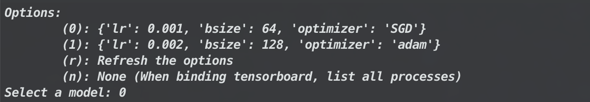
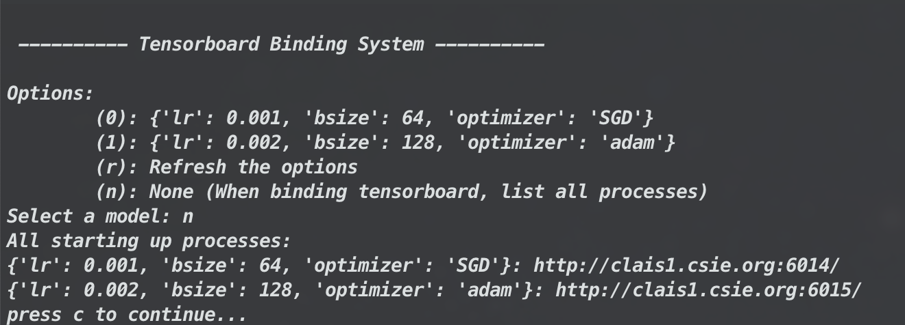

# MDHandler
MDH: A model handler systematically handling your machine learning models in a unified way.

## Features

MDH is a yaml-based configurations organizer, which could easily organize your machine learning models with a command line interface.

MDH supports 2 functions, **model handling** and **tensorboard binding**

### Model Handling

MDH organizes your models, provides an interface to choose models according to their configurations.

**Sample Command**

```
python save_load_model.py -c <configuration> -m <model_configuration>
```

**Sample Screenshot**



### Tensorboard Binding

MDH also provides a tensorboard binding tool, one could bind all tensorboard processes in one program.

**Sample Command**

```
python board.py -c <configuration> --h <host_name>
```

**Sample Screenshot**



## Installation

One should only need to install tensorboard, and PyYAML.

```
pip install -r requirements.txt
```

## Usage

How to easily involve MDH with my code?

For model handling, one should only have to make **3 changes**.

1. Build a configuraiton for loading MDH.

    When loading MDH, one should specify the **model path**, and the **hash table name**. (Better stored in a yaml-based configuration file, see the [sample config](./sample_config/sample_config.yaml)) 
   
    * model path: The directory storing all models.
    
    * hash table name: MDH using a hash table to map and handle models, one should determine the stored hash table name beforehand.

    ```python
    from mdh import model_handler
    mdh = model_handler(
        <model_path>,
        <hash_table_name>,
        <title> # if needed, one could add a title when selecting models
    )
    ```
2. Update MDH when storing a model.

    When storing a model, update MDH according to the model's configuraiton.

    ```
    mdh.update(<config>)
    ```
3. Load model according to MDH's API

    Here is the default directory hirarchy in MDH:
    ```
    # -- model_path/ (saving models in this path)
    #  |
    #  |__ model_1/ (in a hashing form)
    #  |  |
    #  |  |__ log/ (training log, for tensorboard)
    #  |  |
    #  |  |__ 1000.pt (a model checkpoint)
    #  |  |
    #  |  |__ 2000.pt (another model checkpoint)
    #  |  
    #  |__ model_2/
    #  |  |
    #  |  |__ log/
    #  |  |
    #  |  |__ 1000.pt
    #  |
    #  |＿ <hash_table_name>.pkl (Save your hash info)
    #  .
    ```
    
    When loading a model, one should first select the model configuration in runtime. (by using the following command)

    ```
    config = mdh.select_config()
    ```
    
    MDH provides 3 methods
    
    1. Get the directory which saving checkpoints
        ```
        mdh.get_ckpt_dir(config)
        ```
    2. Get a certain checkpoint
        ```
        mdh.get_ckpt(config, epoch=None)
        ```
    3. Get the log directory
        ```
        mdh.get_log(config)
        ```
        
For tensorboard binding, one could directly execute `board.py`. 

Note that, to load MDH, one should specify the **model path**, and the **hash table path** in a configuration file beforehand. (see the [sample config](./sample_config/sample_config.yaml))

```
python board.py -c <configuration> --host <host_name>
```
